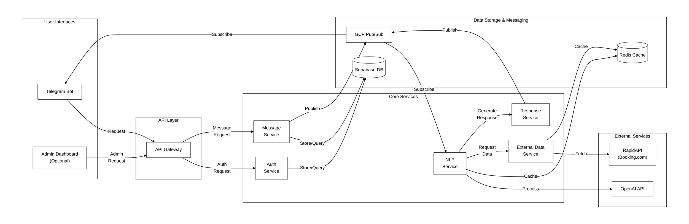
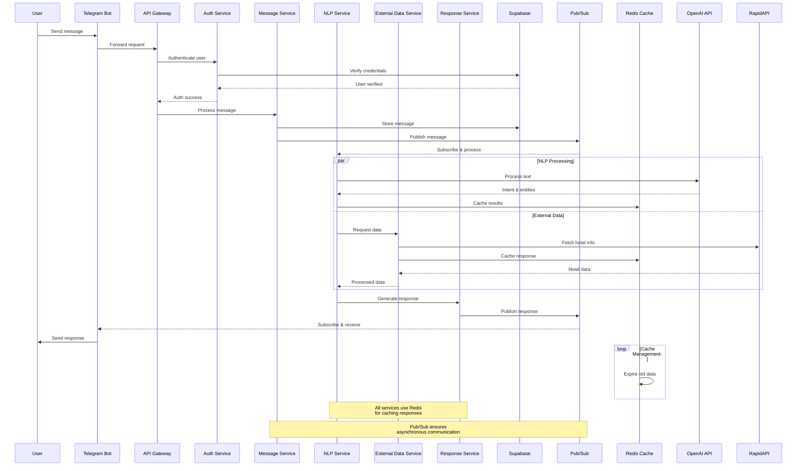

# Modern ISONER

Modern implementation of ISONER (Information System on Internet Messenger) framework using microservices architecture. This project modernizes the original ISONER concept with Python, FastAPI, Supabase, Redis, and GCP Pub/Sub, providing a scalable and efficient chatbot system accessible through Telegram.

Key features:
- Microservices architecture with Python and FastAPI
- Supabase (PostgreSQL) for database
- GCP Pub/Sub for message broker
- Redis for caching
- OpenAI integration for advanced NLP
- Telegram Bot interface
- Role-Based Access Control (RBAC)
- Containerized with Docker and orchestrated with Kubernetes
- Infrastructure as Code with Terraform

## Architecture

This project implements a microservices architecture for a chatbot system with the following components:

- **API Gateway**: Routes requests to appropriate services
- **Auth Service**: Handles user authentication and authorization
- **Message Service**: Manages user messages and conversations
- **NLP Service**: Processes messages using OpenAI API
- **External Data Service**: Fetches data from external APIs (e.g., hotel information)
- **Response Service**: Generates and formats responses to users

### System Flow Diagram



### Sequence Diagram



## Technologies

- **Backend**: Python 3.11+ with FastAPI
- **Database**: Supabase (PostgreSQL)
- **Message Broker**: Google Cloud Pub/Sub
- **Caching**: Redis
- **NLP**: OpenAI GPT API
- **External Data**: RapidAPI (Hotels API from Booking.com)
- **Deployment**: Google Cloud Run
- **Infrastructure as Code**: Terraform
- **CI/CD**: GitHub Actions

## Security & Access Control

This project implements Role-Based Access Control (RBAC) for secure access management:

- **Authentication**: JWT-based authentication via Supabase Auth
- **Authorization**: Custom middleware for permission and role checks
- **Roles**: Pre-defined roles (admin, manager, user) with different access levels
- **Permissions**: Granular permissions for specific actions
- **Row Level Security**: Database-level security policies in Supabase

## Development Setup

### Prerequisites

- Python 3.11+
- Docker and Docker Compose
- Google Cloud SDK
- Supabase account
- Redis instance (local or cloud)
- OpenAI API key
- RapidAPI key
- Telegram Bot token

### Environment Variables

Create a `.env` file in the root directory with the following variables:

```
# Supabase
SUPABASE_URL=your_supabase_url
SUPABASE_KEY=your_supabase_key

# GCP
GCP_PROJECT_ID=your_gcp_project_id
GOOGLE_APPLICATION_CREDENTIALS=path/to/your/credentials.json

# Redis
REDIS_HOST=your_redis_host
REDIS_PORT=6379
REDIS_PASSWORD=your_redis_password

# API Keys
OPENAI_API_KEY=your_openai_api_key
RAPIDAPI_KEY=your_rapidapi_key

# JWT
JWT_SECRET=your_jwt_secret_key

# Telegram
TELEGRAM_BOT_TOKEN=your_telegram_bot_token
```

### Database Setup

1. Run the combined SQL setup script to create all necessary tables and functions:

```bash
psql -U your_username -d your_database -f sql/combined_setup.sql
```

### Running Locally

1. Start the services using Docker Compose:

```bash
docker-compose up
```

2. Access the API Gateway at http://localhost:8000

### Deployment

1. Set up GCP project and enable required APIs:

```bash
gcloud services enable pubsub.googleapis.com run.googleapis.com artifactregistry.googleapis.com
```

2. Create Pub/Sub topics and subscriptions:

```bash
./scripts/create_topics.sh your-gcp-project-id
```

3. Deploy to GCP:

```bash
./scripts/deploy.sh your-gcp-project-id us-central1
```

## Project Structure

```
modern-isoner/
├── api_gateway/         # API Gateway service
├── auth_service/        # Authentication service
├── message_service/     # Message handling service
├── nlp_service/         # Natural Language Processing service
├── external_data_service/ # External data fetching service
├── response_service/    # Response generation service
├── telegram_bot/        # Telegram Bot interface
├── middleware/          # Shared middleware components
├── routes/             # API route definitions
├── terraform/          # Infrastructure as code
├── scripts/            # Utility scripts
├── sql/               # SQL scripts
└── .github/workflows/  # CI/CD pipelines
```

## Contributing

1. Fork the repository
2. Create a feature branch: `git checkout -b feature-name`
3. Commit your changes: `git commit -m 'Add feature'`
4. Push to the branch: `git push origin feature-name`
5. Submit a pull request

## License

This project is licensed under the MIT License - see the LICENSE file for details.