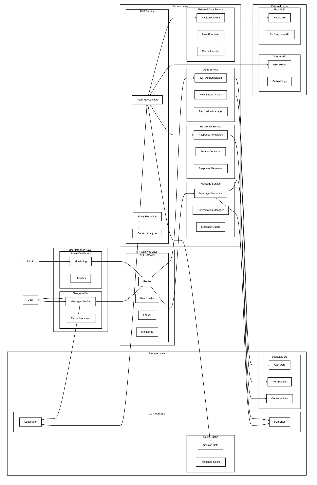

# Modern ISONER

Modern implementation of ISONER (Information System on Internet Messenger) framework using microservices architecture. This project modernizes the original ISONER concept with Python, FastAPI, Supabase, Redis, and GCP Pub/Sub, providing a scalable and efficient chatbot system accessible through Telegram.

Key features:
- Microservices architecture with Python and FastAPI
- Supabase (PostgreSQL) for database
- GCP Pub/Sub for message broker
- Redis for caching
- OpenAI integration for advanced NLP
- Telegram Bot interface
- Role-Based Access Control (RBAC)
- Containerized with Docker and orchestrated with Kubernetes
- Infrastructure as Code with Terraform

## Architecture

This project implements a microservices architecture for a chatbot system with the following components:

- **API Gateway**: Routes requests to appropriate services
- **Auth Service**: Handles user authentication and authorization
- **Message Service**: Manages user messages and conversations
- **NLP Service**: Processes messages using OpenAI API
- **External Data Service**: Fetches data from external APIs (e.g., hotel information)
- **Response Service**: Generates and formats responses to users

### System Flow Diagram

